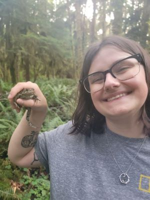

# Airianna McGuire

## About Me
I am a PhD student in the UConn EEB department interested in structural variants related to climate adapatation in an Arctic salmonid, and how pangenomes can be leveraged to assess structural variation.

[My CV](PDFs/cv.pdf)

[Contact Info](contact-info.html)

